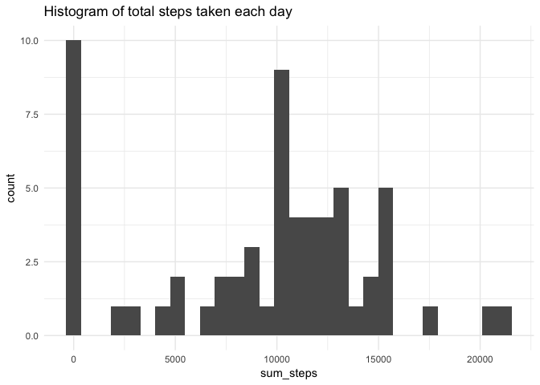
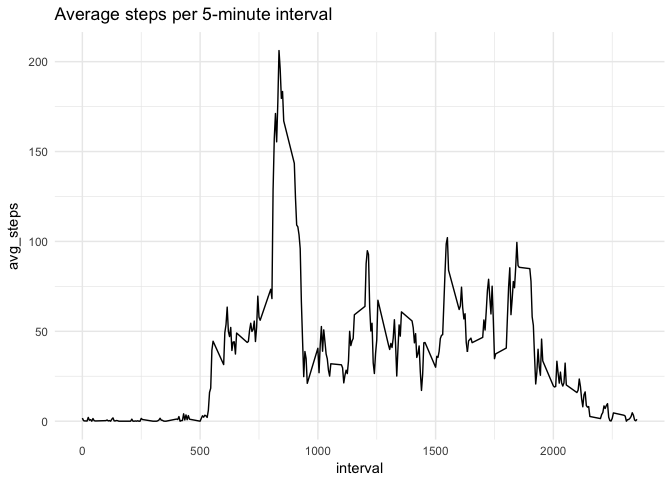
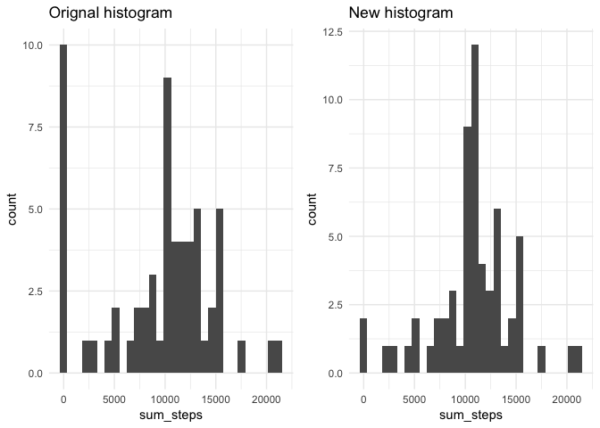
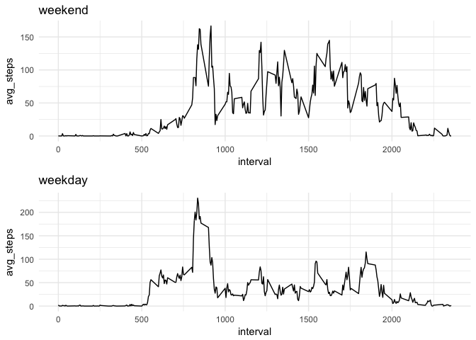

Loading necessary packages
--------------------------

    lapply(c('lubridate', 'dplyr', 'ggplot2', 'gridExtra', 'knitr'), library, character.only = T, warn.conflicts = F, quietly = T)

    ## Warning: package 'dplyr' was built under R version 3.4.2

    ## Warning: package 'gridExtra' was built under R version 3.4.1

    ## Warning: package 'knitr' was built under R version 3.4.1

    ## [[1]]
    ## [1] "lubridate" "stats"     "graphics"  "grDevices" "utils"     "datasets" 
    ## [7] "methods"   "base"     
    ## 
    ## [[2]]
    ## [1] "dplyr"     "lubridate" "stats"     "graphics"  "grDevices" "utils"    
    ## [7] "datasets"  "methods"   "base"     
    ## 
    ## [[3]]
    ##  [1] "ggplot2"   "dplyr"     "lubridate" "stats"     "graphics" 
    ##  [6] "grDevices" "utils"     "datasets"  "methods"   "base"     
    ## 
    ## [[4]]
    ##  [1] "gridExtra" "ggplot2"   "dplyr"     "lubridate" "stats"    
    ##  [6] "graphics"  "grDevices" "utils"     "datasets"  "methods"  
    ## [11] "base"     
    ## 
    ## [[5]]
    ##  [1] "knitr"     "gridExtra" "ggplot2"   "dplyr"     "lubridate"
    ##  [6] "stats"     "graphics"  "grDevices" "utils"     "datasets" 
    ## [11] "methods"   "base"

Loading and preprocessing the data
----------------------------------

The codes below are used to

1.  Load the data (i.e. read.csv())

<!-- -->

    activity = read.csv('activity.csv', stringsAsFactors = F)
    summary(activity)

    ##      steps            date              interval     
    ##  Min.   :  0.00   Length:17568       Min.   :   0.0  
    ##  1st Qu.:  0.00   Class :character   1st Qu.: 588.8  
    ##  Median :  0.00   Mode  :character   Median :1177.5  
    ##  Mean   : 37.38                      Mean   :1177.5  
    ##  3rd Qu.: 12.00                      3rd Qu.:1766.2  
    ##  Max.   :806.00                      Max.   :2355.0  
    ##  NA's   :2304

1.  Process/transform the data (if necessary) into a format suitable for
    your analysis

<!-- -->

    activity$date = ymd(activity$date)
    summary(activity)

    ##      steps             date               interval     
    ##  Min.   :  0.00   Min.   :2012-10-01   Min.   :   0.0  
    ##  1st Qu.:  0.00   1st Qu.:2012-10-16   1st Qu.: 588.8  
    ##  Median :  0.00   Median :2012-10-31   Median :1177.5  
    ##  Mean   : 37.38   Mean   :2012-10-31   Mean   :1177.5  
    ##  3rd Qu.: 12.00   3rd Qu.:2012-11-15   3rd Qu.:1766.2  
    ##  Max.   :806.00   Max.   :2012-11-30   Max.   :2355.0  
    ##  NA's   :2304

What is mean total number of steps taken per day?
-------------------------------------------------

1.  Make a histogram of the total number of steps taken each day

<!-- -->

    activity  %>%
            group_by(date)  %>%
            summarise(sum_steps = sum(steps, na.rm = T))  %>%
            ggplot(aes(x = sum_steps)) + geom_histogram() + ggtitle('Histogram of total steps taken each day') + theme_minimal()

    ## `stat_bin()` using `bins = 30`. Pick better value with `binwidth`.

1.  Calculate and report the mean and median total number of steps taken
    per day

<!-- -->

    activity  %>%
            group_by(date)  %>%
            summarise(sum_steps = sum(steps, na.rm = T))  %>%
            summary()

    ##       date              sum_steps    
    ##  Min.   :2012-10-01   Min.   :    0  
    ##  1st Qu.:2012-10-16   1st Qu.: 6778  
    ##  Median :2012-10-31   Median :10395  
    ##  Mean   :2012-10-31   Mean   : 9354  
    ##  3rd Qu.:2012-11-15   3rd Qu.:12811  
    ##  Max.   :2012-11-30   Max.   :21194

The mean total number of steps taken each day is 9354 steps and median
is 10395 steps.

What is the average daily activity pattern?
-------------------------------------------

1.  Make a time series plot (i.e. type = "l") of the 5-minute
    interval (x-axis) and the average number of steps taken, averaged
    across all days (y-axis)

<!-- -->

    activity  %>%
            group_by(interval)  %>%
            summarise(avg_steps = mean(steps, na.rm = T))  %>%
            ggplot(aes(x = interval, y = avg_steps)) + geom_line() + ggtitle('Average steps per 5-minute interval') + theme_minimal()

1.  Which 5-minute interval, on average across all the days in the
    dataset, contains the maximum number of steps?

<!-- -->

    avg_steps = activity  %>%
            group_by(interval)  %>%
            summarise(avg_steps = mean(steps, na.rm = T))
    avg_steps$interval[which.max(avg_steps$avg_steps)]

    ## [1] 835

835th 5-min interval contains the maxmum number of steps (206 steps).

Imputing missing values
-----------------------

1.  Calculate and report the total number of missing values in the
    dataset (i.e. the total number of rows with NAs)

Percentage of NA rows for each column is as below:

    colSums(is.na(activity))/dim(activity)[1]

    ##     steps      date  interval 
    ## 0.1311475 0.0000000 0.0000000

1.  Devise a strategy for filling in all of the missing values in
    the dataset. The strategy does not need to be sophisticated. For
    example, you could use the mean/median for that day, or the mean for
    that 5-minute interval, etc.

We will use impute the mean number of steps for 5-min interval into NA
rows of steps.

1.  Create a new dataset that is equal to the original dataset but with
    the missing data filled in.

<!-- -->

    avg_steps_imp = rep(avg_steps$avg_steps, length(unique(activity$date)))
    activity_new = activity
    activity_new$steps[is.na(activity$steps)] = avg_steps_imp[is.na(activity$steps)]
    summary(activity_new)

    ##      steps             date               interval     
    ##  Min.   :  0.00   Min.   :2012-10-01   Min.   :   0.0  
    ##  1st Qu.:  0.00   1st Qu.:2012-10-16   1st Qu.: 588.8  
    ##  Median :  0.00   Median :2012-10-31   Median :1177.5  
    ##  Mean   : 37.38   Mean   :2012-10-31   Mean   :1177.5  
    ##  3rd Qu.: 27.00   3rd Qu.:2012-11-15   3rd Qu.:1766.2  
    ##  Max.   :806.00   Max.   :2012-11-30   Max.   :2355.0

1.  Make a histogram of the total number of steps taken each day and
    Calculate and report the mean and median total number of steps taken
    per day. Do these values differ from the estimates from the first
    part of the assignment? What is the impact of imputing missing data
    on the estimates of the total daily number of steps?

<!-- -->

    p1 = activity  %>%
            group_by(date)  %>%
            summarise(sum_steps = sum(steps, na.rm = T))  %>%
            ggplot(aes(x = sum_steps)) + geom_histogram() + ggtitle('Orignal histogram') + theme_minimal()

    p2 = activity_new  %>%
            group_by(date)  %>%
            summarise(sum_steps = sum(steps, na.rm = T))  %>%
            ggplot(aes(x = sum_steps)) + geom_histogram() + ggtitle('New histogram') + theme_minimal()

    grid.arrange(p1, p2, ncol = 2)

    ## `stat_bin()` using `bins = 30`. Pick better value with `binwidth`.
    ## `stat_bin()` using `bins = 30`. Pick better value with `binwidth`.

    activity  %>%
            group_by(date)  %>%
            summarise(sum_steps = sum(steps, na.rm = T))  %>%
            summary()

    ##       date              sum_steps    
    ##  Min.   :2012-10-01   Min.   :    0  
    ##  1st Qu.:2012-10-16   1st Qu.: 6778  
    ##  Median :2012-10-31   Median :10395  
    ##  Mean   :2012-10-31   Mean   : 9354  
    ##  3rd Qu.:2012-11-15   3rd Qu.:12811  
    ##  Max.   :2012-11-30   Max.   :21194

    activity_new  %>%
            group_by(date)  %>%
            summarise(sum_steps = sum(steps, na.rm = T))  %>%
            summary()

    ##       date              sum_steps    
    ##  Min.   :2012-10-01   Min.   :   41  
    ##  1st Qu.:2012-10-16   1st Qu.: 9819  
    ##  Median :2012-10-31   Median :10766  
    ##  Mean   :2012-10-31   Mean   :10766  
    ##  3rd Qu.:2012-11-15   3rd Qu.:12811  
    ##  Max.   :2012-11-30   Max.   :21194

Are there differences in activity patterns between weekdays and weekends?
-------------------------------------------------------------------------

1.  Create a new factor variable in the dataset with two levels --
    "weekday" and "weekend" indicating whether a given date is a weekday
    or weekend day.

<!-- -->

    weekday = ifelse(weekdays(activity_new$date, T) %in% c('Sat', 'Sun'), 'weekend', 'weekday')
    activity_new$weekday = weekday

1.  Make a panel plot containing a time series plot (i.e. type = "l") of
    the 5-minute interval (x-axis) and the average number of steps
    taken, averaged across all weekday days or weekend days (y-axis).

<!-- -->

    p3 = activity_new  %>%
            filter(weekday == 'weekend')  %>%
            group_by(interval)  %>%
            summarise(avg_steps = mean(steps, na.rm = T))  %>%
            ggplot(aes(x = interval, y = avg_steps)) + geom_line() + ggtitle('weekend') + theme_minimal()

    p4 = activity_new  %>%
            filter(weekday == 'weekday')  %>%
            group_by(interval)  %>%
            summarise(avg_steps = mean(steps, na.rm = T))  %>%
            ggplot(aes(x = interval, y = avg_steps)) + geom_line() + ggtitle('weekday') + theme_minimal()

    grid.arrange(p3, p4, nrow = 2)

